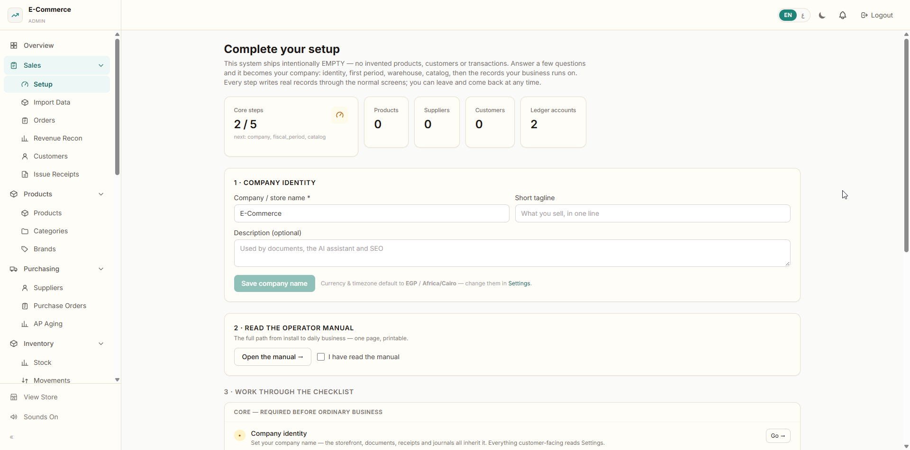
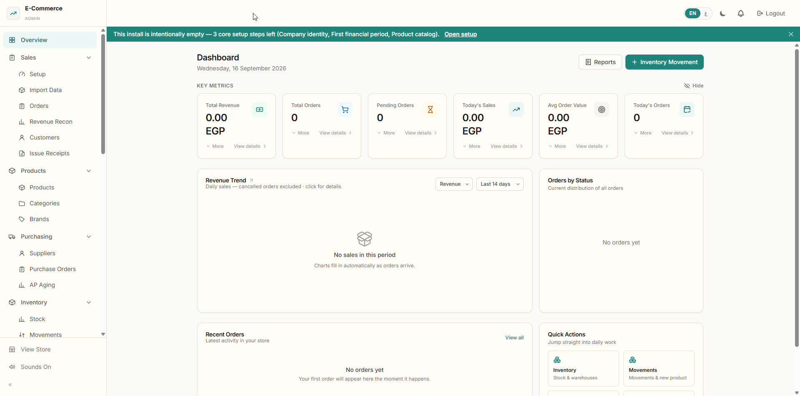
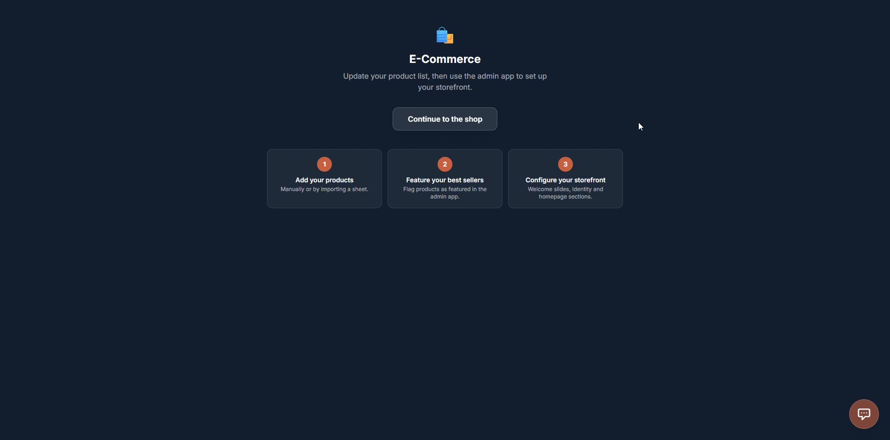
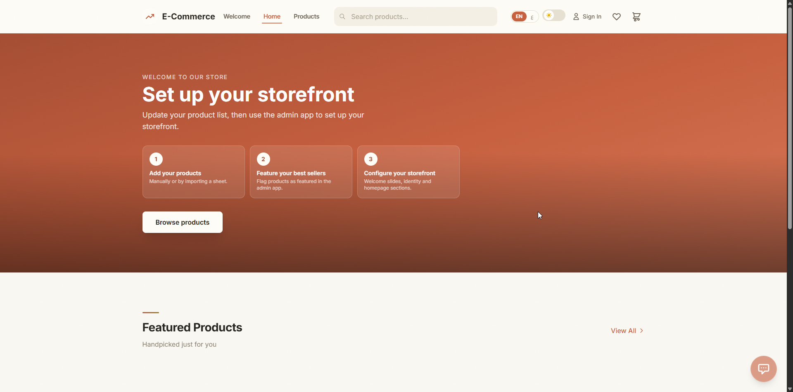
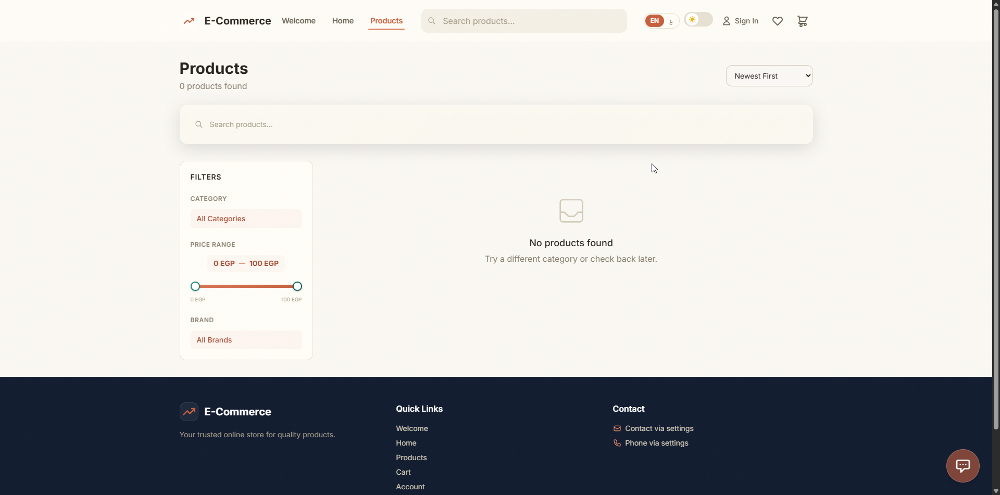
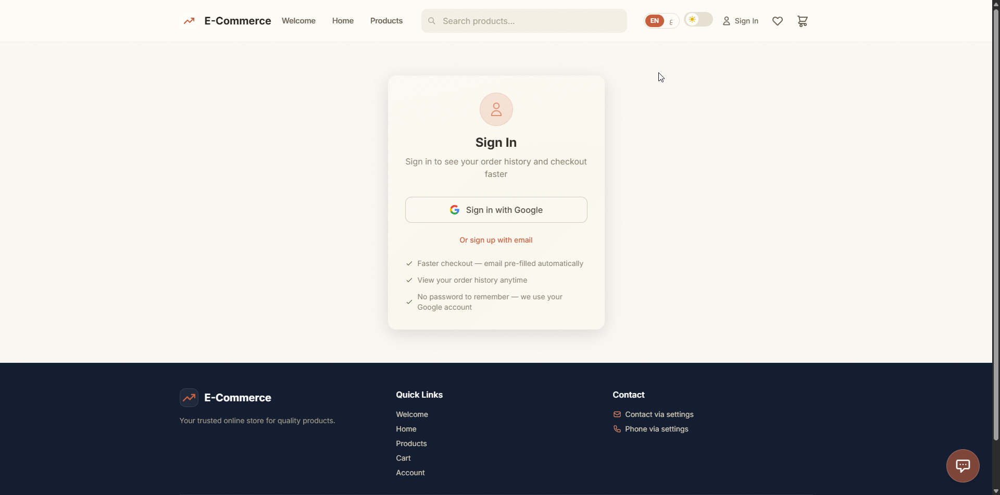
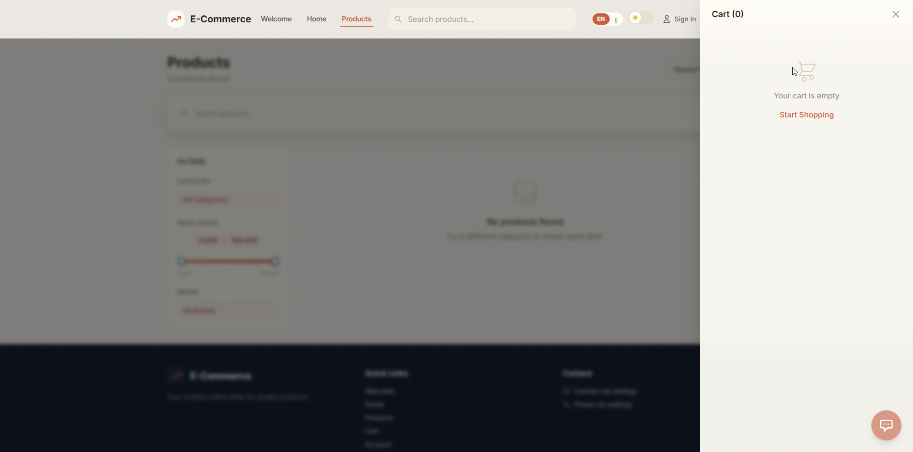
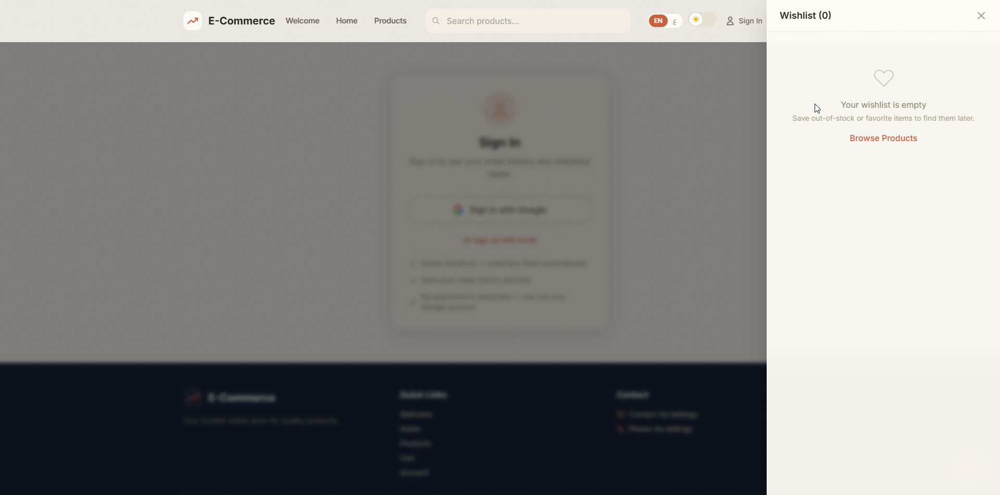

# Ecom-ERP — E-commerce + ERP, zero hosting cost

Self-hosted store + back-office in one repo. Runs from a local PC: Node.js API, two React frontends, file-based SQLite, optional public tunnel. No monthly hosting bill — payment providers take only per-transaction fees.

## What it does

- **Storefront** — catalog, search, variants (color/size), cart, COD + online checkout, wishlist, order history, Google sign-in.
- **Admin ERP** — inventory movements ledger, warehouses/locations, suppliers, purchase orders, document numbering, reports + CSV, settings engine, notifications, QR codes, webhooks, users/roles/permissions, immutable event audit trail.
- **Accounting that is real** — one journal model: chart of accounts, purchase receipts → payables, supplier payments, every sale settlement (online, COD, counter, wire) posts cash/revenue/COGS, refunds reverse through immutable entries, manual journals, period locks that fail closed, journal-derived Trial Balance / P&L / Balance Sheet, plus AP-aging, revenue and inventory↔GL reconciliation controls.
- **First run is a guided setup** — a fresh install is intentionally empty (no fake demo data), the wizard answers "what does this system need to become my company?", and CSV/XLSX onboarding previews, validates, dedupes and commits atomically. See [docs/FIRST_RUN.md](docs/FIRST_RUN.md).
- **Mobile** — customer app + staff worker app (Expo), server-side cart, proof-of-delivery.
- **Payments** — Kashier (live), cash on delivery; Stripe route kept as legacy fallback; Paymob planned.

## Screenshots (fresh install, English · light)

A brand-new install is intentionally empty — this is what day zero looks like. The full operator walkthrough (14 sections) lives in the admin app at `/manual.html`.

### Admin — guided setup

> **Setup wizard (`/setup`, admin app).** The three-step fresh start: 1 · Company identity (store name, tagline, description — written straight into Settings so receipts, journals and the storefront carry it), 2 · the operator-manual checkpoint with “I have read the manual” acknowledgment, 3 · the live checklist (core steps plus counters for products, suppliers, customers and ledger accounts). The 2/5 core-steps card names exactly what's next — company, fiscal period, catalog — recomputed from real records on every visit, so it can never claim something that isn't true.


> **Empty dashboard (admin Overview).** Day zero with zero business: every metric reads 0 / 0.00 EGP, charts honestly say “No sales in this period” and “Charts fill in automatically as orders arrive,” and a green banner tracks the remaining core setup steps with a direct “Open setup” link. Nothing is faked to look busy — the numbers only move when real orders happen.

### Storefront — guided empty states

> **Welcome screen (`/`, storefront).** Instead of a blank page or an endless spinner, a fresh store shows the merchant exactly what to do: update the product list, feature best sellers, configure the storefront in the admin app — with “Continue to the shop” always available. Once welcome slides are configured in the admin (Site Config → Welcome), this becomes the full-screen photo slider.


> **Home hero (`/home`, no products yet).** The hero section doubles as a setup guide: three glass cards (add products manually or by sheet, flag best sellers as featured, configure slides/identity/sections) plus a “Browse products” button. The moment the first product exists, the hero automatically shows real products; flagging products as featured in the admin gives the curated Ken Burns slideshow.


> **Product catalog (`/products`, empty).** “0 products found” with a plain-language hint, while the filter sidebar (category, dual-thumb price range, brand) stays fully usable — it sticks in place while scrolling on desktop and becomes a slide-in drawer on mobile. Filters populate themselves from real data the moment the first import or product lands.


> **Customer sign-in.** Google one-tap plus email signup — no passwords to remember. Signing in unlocks faster checkout (pre-filled email), order history, wishlist sync and account profile. Every customer row is created by a real signup; the system never invents customer accounts.


> **Empty cart drawer.** Slides in from the side with a friendly “Your cart is empty / Start Shopping” path back to browsing. The drawer later carries quantities with large touch steppers, live totals in the active currency (Arabic mode renders Hindi digits), and the checkout entry point.


> **Empty wishlist drawer.** Same pattern: honest empty copy (“save out-of-stock or favorite items to find them later”) with a “Browse Products” way back. Hearts across product cards feed this list once the catalog fills.

## Requirements

- Node.js 18+

## Quick start

### 1. Configure secrets

```bash
copy server\.env.example server\.env
```

Edit `server/.env` and set real values (never commit this file):

```
PORT=5172
ADMIN_USERNAME=<admin-user>
ADMIN_PASSWORD=<strong-password>
SESSION_SECRET=<random-string>
JWT_SECRET=<random-string>
CLIENT_URL=http://localhost:5173
```

Payment / mail / AI keys are managed at runtime via the admin Integrations page (stored in the settings table, secrets masked). `.env` is only the bootstrap.

### 2. Install & run

```bash
start.ps1
```

Or manually — one terminal per surface:

```bash
cd server && npm install && npm start        # API → http://localhost:5172
cd client && npm install && npm run dev      # storefront → http://localhost:5173
cd client-admin && npm install && npm run dev  # admin ERP → http://localhost:5174
```

Health: `http://localhost:5172/api/health`

### 3. Expose publicly (optional, free)

```bash
start.ps1 tunnel
```

Point the payment provider webhook at the public URL. Inspect traffic at the tunnel's local UI while testing.

## Project structure

```
ecom-erp/
├── start.ps1        # one-click launcher (app / tunnel / prod)
├── server/          # Express API (index.js, db.js, routes/, services/, middleware/)
├── client/          # customer storefront (React + Vite)
├── client-admin/    # admin ERP panel (React + Vite)
├── mobile-app/      # customer app (Expo, separate nested repo)
├── worker-app/      # staff app (Expo, separate nested repo)
├── docs/            # PROJECT_STATE, HANDOVER, BACKLOG, CHANGELOG, guides
├── deps/            # external reference material (read-only, never imported)
└── tickets/         # local working tickets (not committed)
```

## Configuration rules

- Every configurable value lives in the **settings table** (admin UI editable).
- `.env` holds **secrets + per-machine hosts only**.
- Store identity (name, logo, tagline, currency) comes from `GET /api/settings/public` — never hardcoded in UI.
- Inventory is movement-derived only; documents are never deleted (cancelled is a status); every mutation emits an event.

## Testing

```bash
cd server
npm test                 # unit
npm run test:integration # API (boots the real DB — never destructive)
```

Both suites must pass before any change is considered done.

## Security

- Secrets only in `server/.env` (gitignored) or the masked settings store.
- Session + JWT auth, RBAC re-validated backend-side, CSRF on admin mutations, rate limits, Helmet headers, parameterized queries.
- Rotate all keys before exposing any public URL.

## Docs

Start with `docs/PROJECT_STATE.md`, then `docs/HANDOVER.md`, `docs/SETUP.md`, `docs/API_DOCUMENTATION.md`.

## License

MIT
